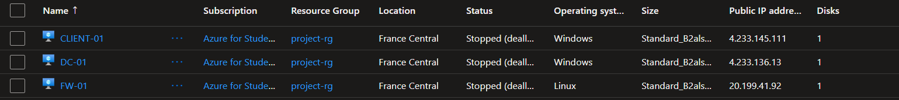
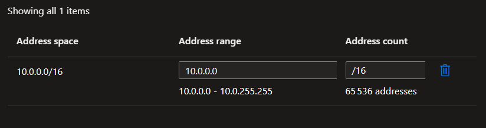

# Azure Network and Active Directory Lab

## Overview

This project documents the deployment of a small enterprise-style environment in Microsoft Azure. The goal was to build a functional network with centralized identity management, apply security controls, and validate connectivity between systems.

The lab includes virtual network design, virtual machine deployment, Active Directory configuration, group policy enforcement, and network-level troubleshooting.

---

## Architecture

The environment consists of three virtual machines:

* **DC-01** – Domain Controller running Active Directory Domain Services
* **FW-01** – Linux-based firewall and routing host
* **WIN10-01** – Domain-joined client machine



The machines are deployed in a single virtual network and separated using subnets to simulate internal segmentation.

---

## Azure Network Configuration

### Virtual Network

* Address space: 10.0.0.0/16



### Subnets

* 10.0.1.0/24 – Internal subnet (Domain Controller and Client)
* 10.0.2.0/24 – External subnet (Firewall interface)

### Routing

* Custom routing was configured so that traffic between subnets passes through the firewall
* IP forwarding was enabled on the firewall VM to allow packet traversal

---

## Virtual Machine Setup

### Domain Controller (DC-01)

* Windows Server deployed in the internal subnet
* Roles installed:

  * Active Directory Domain Services
  * DNS Server
* Promoted to domain controller with the domain:

  * internal.cloudapp.net

---

### Client Machine (WIN10-01)

* Windows client joined to the domain
* Configured to use the domain controller as its DNS server
* Used for testing authentication, policy enforcement, and connectivity

---

### Firewall (FW-01)

* Ubuntu Linux VM with two network interfaces:

  * eth0 (external subnet)
  * eth1 (internal subnet)
* Configured for:

  * IP forwarding
  * Routing between subnets
  * Packet inspection using tcpdump

---

## Active Directory Configuration

An organizational structure was created to simulate a typical company environment.

### Organizational Units

* IT
* HR
* Users

### Security Groups

* IT_Admins
* HR_Users

### User Accounts

Test user accounts were created and assigned to their respective OUs and groups to validate access control and policy application.

---

## Group Policy Configuration

Group Policies were configured and linked to the appropriate OUs to enforce:

* Password complexity and length requirements
* Account lockout policies
* Basic workstation restrictions for standard users
* Security baseline settings

These policies were tested from the client machine after domain join.

---

## Network Security Configuration

* Windows Firewall rules were reviewed and adjusted where necessary
* Azure Network Security Groups were used to control inbound and outbound traffic
* The firewall VM was used to simulate inspection and control of inter-subnet traffic

---

## Testing and Validation

### Connectivity Testing

Basic connectivity was tested using ICMP between machines to verify routing and reachability.

Example:


---

### Packet Capture

Traffic was analyzed on the firewall using tcpdump to observe packet flow between subnets.

Command used:

```
tcpdump -i eth1 icmp
```

Example capture:


---

### Routing Verification

Routing tables were checked on both Linux and Windows systems:

* Linux:

  ```
  ip route
  ```

* Windows:

  ```
  route print
  ```

---

## Observations

* Proper routing configuration is critical when introducing a firewall between subnets
* Traffic may be dropped before reaching the operating system due to cloud-level controls such as Network Security Groups
* Packet capture tools are useful to determine whether traffic is reaching an interface or being blocked upstream
* Misconfigurations in routing or security policies can result in silent packet drops and timeouts

---

## Conclusion

This lab provided hands-on experience with:

* Deploying infrastructure in Azure
* Configuring Active Directory and domain services
* Managing users, groups, and policies
* Implementing basic network segmentation
* Troubleshooting connectivity using routing analysis and packet capture

---

## Future Work

* Add centralized logging and monitoring
* Integrate a SIEM solution
* Expand the environment with additional subnets or services
* Test more advanced firewall rules and inspection techniques

---

## Author

Your Name
Cloud and Cybersecurity Student

