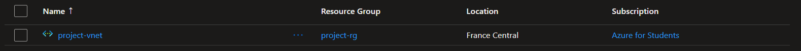
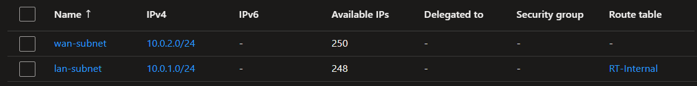
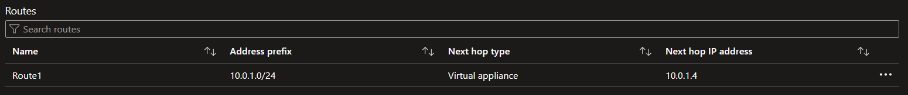
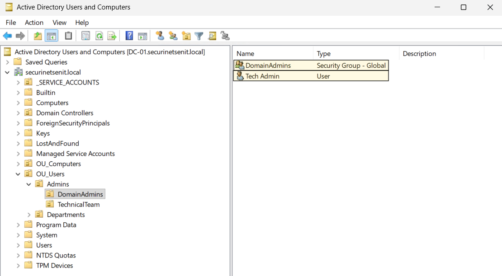
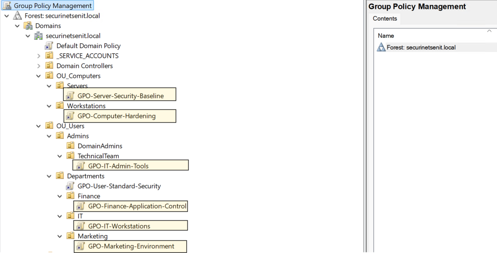
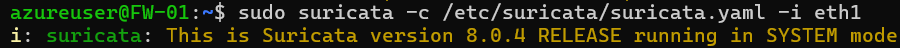

# Enterprise Infrastructure — Phase 1

A fully documented Active Directory lab deployed on Microsoft Azure, covering cloud infrastructure provisioning, domain deployment, service hardening, perimeter defense, and attack simulation. This project was completed as part of the SecurinetsENIT security track and sits at the intersection of cybersecurity, cloud computing, and enterprise networking.

---

## Table of Contents

- [Overview](#overview)
- [Cloud Infrastructure](#cloud-infrastructure)
- [Network Architecture](#network-architecture)
- [Environment](#environment)
- [Active Directory Design](#active-directory-design)
- [OU Structure](#ou-structure)
- [Delegation of Control](#delegation-of-control)
- [Group Policy Objects](#group-policy-objects)
- [Services Configuration](#services-configuration)
- [Perimeter Defense](#perimeter-defense)
- [Security Testing](#security-testing)

---

## Overview

This project establishes a secure, fully operational enterprise network inside Microsoft Azure. Rather than relying on local virtualization, the entire lab was provisioned in the cloud using Azure Virtual Machines, Virtual Networks, subnets, Network Security Groups, and custom routing, bringing the infrastructure closer to what a real enterprise deployment looks like.

The scope covers deploying an Active Directory domain from scratch, configuring core Windows services (DNS, LDAP, ADCS, Kerberos), enforcing access controls through GPOs and delegation, and integrating an IDS/IPS firewall for perimeter protection. The build concludes with a structured attack-testing phase to validate the effectiveness of all deployed controls.

---

## Cloud Infrastructure

The lab was built entirely on Azure, with each component provisioned and managed through the Azure portal and CLI.

**Resource Group** — All resources are scoped under a single resource group for centralized management, cost tracking, and clean teardown.

**Virtual Machines** — Each lab component (Domain Controller, Workstation, Firewall) runs as an Azure VM. Machine sizes were selected to balance cost with the compute requirements of Windows Server 2022 and the Firewall.


**Virtual Network (VNet)** — A single VNet spans the entire lab environment, divided into subnets that reflect real network segmentation between the DMZ, internal domain network, and management plane.




**Subnets** — The VNet is split into dedicated subnets: one for the domain infrastructure (DC and workstations), one for the perimeter firewall, and a management subnet for administrative access. This segmentation enforces traffic boundaries at the network layer before any firewall rules apply.



**Network Security Groups (NSGs)** — NSGs are attached to each subnet and NIC to control inbound and outbound traffic. Rules are scoped tightly — only the ports and protocols required for AD, Kerberos, DNS, LDAP, and RDP management are permitted.

**Route Tables (UDR)** — Custom User Defined Routes are applied to force all outbound traffic from the internal subnet through the firewall VM, rather than routing directly out through the Azure default gateway. This ensures all traffic passes through the IDS/IPS layer.



**Static Private IPs** — All VMs are assigned static private IP addresses to ensure consistent DNS resolution, Kerberos ticket validation, and firewall rule targeting across reboots.

---

## Network Architecture

Traffic from the internal subnet to the internet is routed through the firewall via UDR. NSGs enforce subnet-level access control independently of the firewall. The management subnet is isolated and restricted to administrative IPs only.

---

## Environment

| Component | Role | OS / Tool | Azure Notes |
|---|---|---|---|
| Domain Controller | Primary identity and authentication server | Windows Server 2022 | Deployed as an Azure VM with a static private IP; serves as the DNS resolver for the VNet |
| Workstation | Standard client endpoint | Windows 10 / 11 | Domain-joined Azure VM on the internal subnet |
| Firewall | Network security and traffic management | Linux + Zenarmor + Suricata | Azure VM acting as a network virtual appliance (NVA); UDR forces internal traffic through this VM |

---

## Active Directory Design

### OU Structure

The OU layout follows the Principle of Least Privilege, separating objects to allow targeted GPO application and scoped delegation without granting unnecessary access at the domain level.

```
securinetsenit.local
│
├── _SERVICE_ACCOUNTS
│
├── COMPUTERS
│   ├── Workstations
│   └── Servers
│
└── USERS
    ├── Admins
    │   ├── DomainAdmins
    │   └── Technical Team
    │
    └── Departments
        ├── Finance
        ├── Marketing
        └── IT
```



### Delegation of Control

Control is delegated to security groups rather than individual user accounts to maintain accountability and simplify future modifications.

| Group / Role | Target OU(s) | Permissions Granted | Permissions Denied |
|---|---|---|---|
| DomainAdmins | Root Domain, All OUs | Full administrative control including DC management, schema modification, and domain-level GPO linking | No restrictions in the lab environment |
| Technical Team | COMPUTERS/Servers, USERS/Departments/IT | Manage server objects, reset computer accounts, apply GPOs for IT systems, perform routine AD maintenance | Domain-level policy changes, admin account modification, schema changes |
| Finance Department | USERS/Departments/Finance | Read/write on financial shared folders, logon rights to accounting servers, department-specific GPOs | Software installation, network configuration, access to Marketing or IT data |
| Marketing Department | USERS/Departments/Marketing | Read/write on marketing drives and collaboration tools, standard GPO-based security settings | Access to Finance or IT systems, system modification, unauthorized software installation |
| IT Department | USERS/Departments/IT | Elevated permissions to maintain workstations, manage network configs, assist with technical troubleshooting | Schema modifications, domain-level GPO linking, DomainAdmins management |
| Workstations OU Users | COMPUTERS/Workstations | Standard user permissions for business operations and workstation logon | Administrative privileges, software installation, system configuration changes |

### Group Policy Objects

Each GPO is linked to a specific OU to enforce consistent security baselines across users and computers.

| GPO Name | Link Location | Target | Key Settings |
|---|---|---|---|
| Default Domain Policy | Domain Root | All Users / Computers | Password complexity enforced, min length 14 chars, max age 45 days, lockout after 5 attempts. Kerberos ticket lifetime: 10 hours |
| User - Standard Security | USERS/Departments | Finance, Marketing, IT | Screen lock after 10 min idle, Control Panel disabled for Finance/Marketing, CMD/PowerShell restricted for non-IT users |
| Computer - Hardening | COMPUTERS/Workstations | Domain-joined computers | Windows Firewall enforced, guest accounts disabled, USB auto-run blocked, local admin rights removed |
| Server - Security Baseline | COMPUTERS/Servers | Domain and service servers | Object access auditing, anonymous SID enumeration disabled, NTLMv2 enforced, PowerShell execution restricted, NTP sync with DC |
| IT Admin Tools Policy | USERS/Admins/Technical Team | IT administrators | PowerShell execution allowed, remote management enabled, RSAT tools enabled, event log retention enforced |
| Finance Application Control | USERS/Departments/Finance | Finance users | AppLocker/SRP rules (signed executables only), removable drives disabled, restricted access to financial shares |
| Marketing Environment Policy | USERS/Departments/Marketing | Marketing users | Browser proxy and homepage enforced, registry editing disabled, time zone and network configuration locked |
| IT Workstations Policy | USERS/Departments/IT | IT staff systems | Developer tools allowed (Wireshark, Nmap), lab PowerShell scripts permitted, PowerShell and privilege escalation auditing enabled |



---

## Services Configuration

The following services were deployed and configured on the Domain Controller:

**DNS / DHCP** — The DC acts as the authoritative DNS server for the domain. The Azure VNet DNS settings were updated to point all VMs to the DC's static private IP rather than Azure's default resolver, ensuring proper AD name resolution across the environment.

**LDAP / LDAPS** — Secure LDAP functionality was verified to ensure encrypted directory queries across the internal subnet.

**AD Certificate Services (ADCS)** — An Enterprise Certificate Authority was installed and configured on the DC to support certificate-based operations and future ADCS attack scenarios.

**Kerberos** — Correct ticket generation (TGT and TGS) was verified using `klist`. SPNs were documented for use in later attack simulations. Azure's network layer was validated to pass Kerberos traffic correctly between domain members.

---

## Perimeter Defense

**Firewall (Azure NVA)** — Deployed as a Network Virtual Appliance on Azure. A custom UDR applied to the internal subnet forces all outbound and cross-subnet traffic through the firewall VM before it reaches the internet or management plane. Azure IP forwarding was enabled on the firewall VM's NIC to allow it to route traffic it does not originate.

**NSG + Firewall Layered Defense** — Azure NSGs provide a first layer of stateless filtering at the subnet boundary. The Firewall provides stateful inspection, NAT, and deep packet analysis as a second layer. This mirrors a real-world defense-in-depth architecture.

**Zenarmor / Suricata IDS/IPS**
- Initially deployed in IDS mode (monitoring only) to establish a baseline and observe traffic patterns across the virtual network
- Baseline alerts validated by simulating unauthorized traffic between subnets
- Switched to IPS mode for active blocking; configured AD attack signatures validated as blocked



---

## Security Testing

The testing phase validated the defense mechanisms implemented across the AD environment, the Azure network layer, and the firewall.

**Credential Attacks**
- AS-REP Roasting — Targeted accounts with pre-authentication intentionally disabled (lab-only condition)
- Kerberoasting — Exploited weak SPNs on service accounts to test ticket cracking resistance
- Password Spraying / Brute Force — Used to validate account lockout policy enforcement

**Access Control Validation** — Delegated tasks were attempted from each role to confirm restrictions hold at every OU boundary.

**GPO Enforcement Test** — GPOs were verified to apply correctly on the Workstation VM after domain join and policy refresh.

**Network-Level Testing** — Port scans and basic exploit attempts were launched across subnets to validate NSG rules, UDR enforcement, and firewall blocking behavior. Traffic that should never reach the DC was confirmed as dropped at the perimeter.

**Firewall / IPS Test** — Suricata signatures were validated against simulated attack traffic; blocked events were confirmed in the IPS logs.

---

*Prepared by Mohamed Mehdi Abdelli — December 2025

